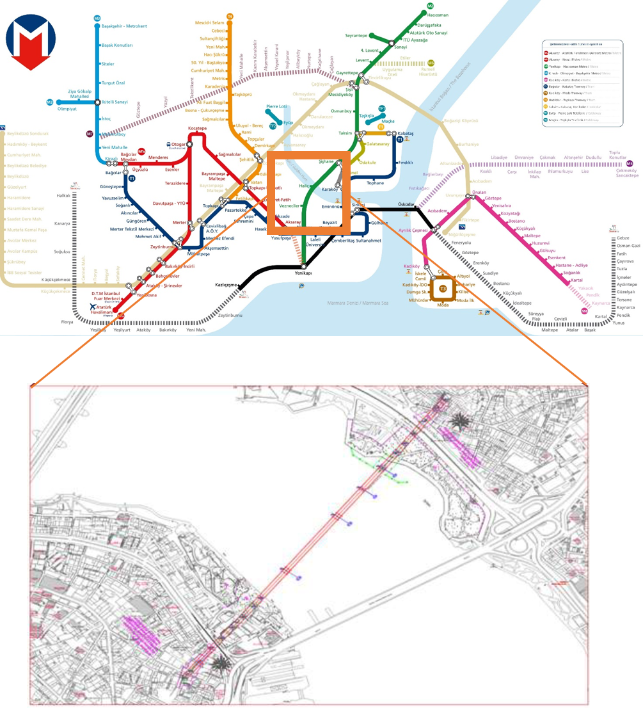
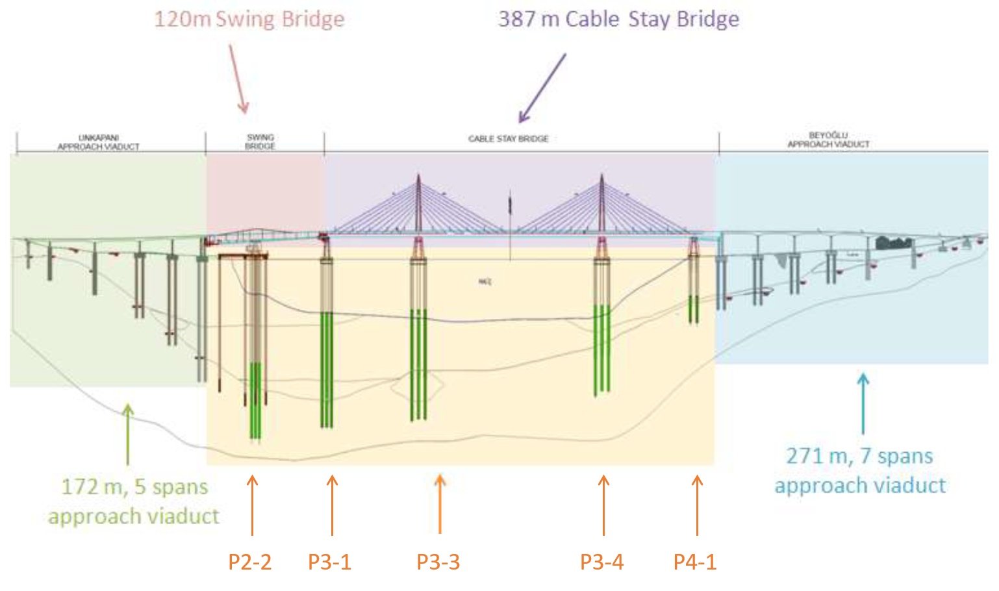
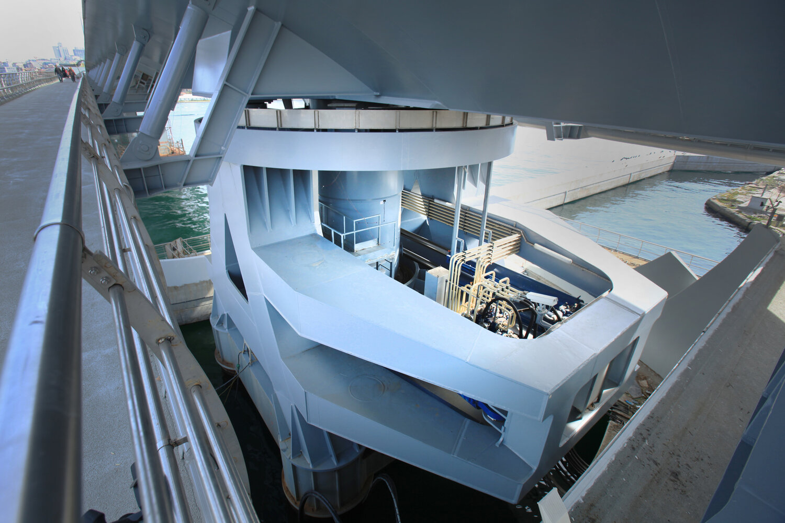

Istanbul Metropolitan Municipality-Dept. of Transportation

Şehzadebaşı Cad 25,

34134 Fatih Istanbul, Turkey

# **Golden Horn Swing Bridge Installation Project**

### Tender HB-S/2021

## **Contract Specifications**

---

# OVERVIEW AND SCOPE OF WORK

## 1.1 Introduction and Background

### Current Conditions

The Golden Horn Metro Crossing Bridge lying at the centre of the ongoing Taksim – Yenikapi Metro Line Construction Project will connect Unkapani and Beyoğlu banks.

### Designed Works

The bridge will consist of 2 approach viaducts, a cable-stayed bridge with a main span of 180 meters and a swing bridge. 

A metro station is situated in the center of the main bridge. 

The deck of the cable-stayed bridge and the swing bridge are designed as steel structures.

This project can be summarized in three main sections.

Starting from the South-West there is an approach viaduct (172 m), a swing bridge (120 m), a cable-stayed bridge (with a total length of 360 m, 2 × 90 m for the side spans and 180 m of main span) and a 27 m long transition segment to compensate for the steel bridge for a total of 507 m. Finally, another approach viaduct (241 m) connects the steel bridge to the tunnel at the other north-east end.

## 1.2 - SCOPE OF WORK

### Contractor’s Scope:

Installation of 120m long Swing Bridge. By means of the ability of moving around its own axis, when open this bridge will allow the naval traffic, and when closed will be integrated with the decks of the Stay Cable Bridge and Unkapanı side Approach Viaduct.

### Owner’s scope:

Construction of reinforced concrete Off-Shore piles, carrying the electromechanical and control room of the swing bridge, standing on 8 no’s Ø1800 piles near Unkapanı bank, between the existing shore line and swing bridge pivot.

## 1.3 – SUPPLY

The Contractor’s supply includes the following components:

1. Swing Bridge Installation
   1. Pre-assembly of the Swing Bridge components
   2. Off-shore Installation
2. Materials and parts
   1. Steel material, including steel structures
   2. Mechanical parts (Lift and Turn Cylinder, Locking Devices and Mechanical Room)

Figure 1. Lift and Turn Cylinder, Mechanical Room

