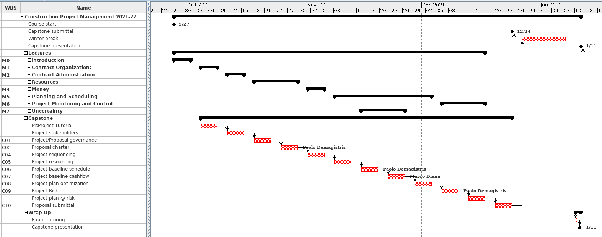

# Contruction Project Management Course

## Fall Term - Academic Year 2021-22

## **Capstone Project**

Instructors:

* Paolo Eugenio Demagistris
* Gabriel Castelblanco

---

# Objective of the work

The term project is aimed at learning Project Management by doing. This will be obtained via reproducing in an academic context the real-life process of preparing, monitoring and controlling a project management plan in compliance to the course lecture and using ISO21500:2012 as a reference.

Most of the work will be executed using Microsoft Project. The software package is available on all LEP workstations. Also, it is possible to download the software at the polito Azure Educational software portal ([https://portal.azure.com/](https://portal.azure.com/?Microsoft_Azure_Education_correlationId=037d3664-8745-41dd-8f6f-f546779d7019#blade/Microsoft_Azure_Education/EducationMenuBlade/software)). A few recitation hours will be spent to let everybody get started with using the software tool.

---

# Team formation

The work will be performed in small teams. The maximum number of members per team is to be defined according to the total number of students in the class. All members will cooperate on the job and nominate a team leader (i.e.: Project Manager) in charge of coordinating the team and monitoring the job status during the full term. It is mandatory to blend the composition of team members in nationality and gender.

Each team will work in a professional and autonomous manner. **Teams must organize as per Tender, Instruction to Bidders - 2.5.1 Proposal Quality Plan**.

---

#  Organization

On a weekly basis, the teams will meet the instructors to report about the job done, get information and suggestion for the next steps. 

The schedule of submission is detailed in the next section. Final presentations will be held for those teams that make it to the shortlist to present live (see &quot;Presentation to Steering Committee&quot; in the next section). Shortlisted teams will be notified after submission.

---

# Schedule of events

---

.
# Referenced document

1. 2021 Term Project instruction | (this document)
2. Tender Documents (Prepared by Owner)
   

---

# Scope of Term Project

As part of an international project, this work reproduces the real-life process of preparing a Bid (ie. Proposal) to supply a Swing Bridge, in response to a Tender from an Owner, within the Metro Stay Cabled Bridge Program, located in Istanbul, Turkey.

---

# Project background

Your company received from the Owner a request to Bid for thei Tender - Swing Bridge Manufacturing and Assembly Project. 
See 2-1-Tender-CL (cover letter) and 2-2-Tender-IB (instruction to Bidders).

*This assignment is inspired by, but not consistent with, a real project that has been completed (https://en.wikipedia.org/wiki/Golden_Horn_Metro_Bridge). Most pieces of information and data have been adjusted for educational purposes only and non-confidential information from the project has been used for developing this case.*

---

# Capstone – Process guidelines (as per ISO21500:2012)

To understand the following instructions, it is highly suggested to have a working understating of the ISO21500:2012 (available through PoliTO library system, link available on course site).

---

# Process Chart

---

# Detailed Processes Instruction

>Will be delivered along the Capstone progress

