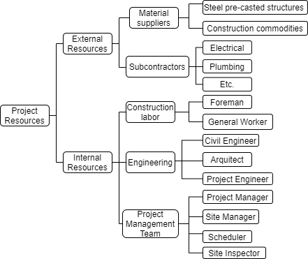

# Introduction to Planning

---
# Project Planning

### Construction project planning is a method of determining 
+ ### “What” is going to be done (Work Breakdown Structure) 
+ ### “How” things are going to be done (Specifications)
+ ### “Who” will be doing activities (Organizational Breakdown Structure) 
+ ### “How much” activities will cost (Cost Breakdown Structure)

---

# General Framework for the Planning Process

#
#
#
#
#
#
#
### Once planning is complete, scheduling can be done, which addresses the “When”
---
# Scope (WBS) - “What” 

### A work breakdown structure (WBS) is a decomposition of the entire scope of work into work packages and elementary activities

### The WBS divides and subdivides a project into different components, whether by area, phase, function, or other considerations.
---
#
# Scope (WBS) - “What” 

#
#
#
#
#
#
#
### Should include **100% of the work** contained in the project scope 
### Provides a **hierarchical decomposition** of elements to the level necessary to plan and manage the work 

---
# WBS 

---
# Scope (WBS) 

#
#
#
#
#
#
#
#

---
# Scope (WBS)
 
### Three creation approaches:
* **Top-down:** Identification of the end deliverable, subdivision of the WBS elements into  detailed and manageable units. (e.g., structure)

* **Bottom-up:** Identification of elements of scope and merging, categorizing and ordering those elements in a hierarchy (e.g., finishings)

* **Hybrid:** combination of top-down and bottom-up approach

---
# Relationships (OBS) - “Who”  
#
#
### The Organization Breakdown Structure decompose the human resources needed to execute all of the tasks into different competence areas and then into project roles unambiguosly.

---
# Scope + Relationships
#
#
#
#
#
#
#
#
### **Roles** should be allocated to detailed **tasks** with a specified number of **resources** and related estimated work load required to perform the task.

---
# Costs (CBS) - “How much” 
#
#
#
#
#
#
#
### The Cost Breakdown Structure is a **hierarchical** system that **classifies** resources into cost accounts, typically **labor**, **materials**, and other direct costs, it represents the economic breakdown of the project into **budgets per work package**.

---

# Approaches to CBS Budgeting - 1. ABC
### Total cost $= Q * (M + EM + W*L)
Where 
Q= Quantity of material required, 
M=Unit cost of material, 
EM=Equipment rate of cost per unit of material, 
W=Hourly wage rate. Affected by insurance, social security, benefits and premiums 
L=Productivity, **learning curves**

---
# Budgeting - 1. ABC

### Real Case Office Project 56.000m2

---
# Approaches to CBS Budgeting - 1. ABC

#
#
#
#
#
#
#
---
# Approaches to CBS Budgeting - 1. ABC

#
#
#
#
#
#
#
---
# Approaches to CBS Budgeting - 2. Cost Code

#
#
#
#
#
#
#
#
---

#  Scheduling

* ### Optimize the information available to the PM team 
* ### Facilitate the likelihood of a successful project completion within the approved schedule baseline

---
# Scheduling - Terms
#
#
#
#
#
#

---
# Scheduling 

 #
 #
 #
 #
 #
 #
 #
 #

---
# Scheduling - Definitions

* ### Activity: Unique scheduled **portion of work** performed with a **non-zero duration** 
* ### Milestone: Significant point or event in the project with a **duration of zero** time periods
* ### Resource: Skilled human resource equipment, services, supplies, commodities,					materials, budgets, or funds required to accomplish the defined work
* ### Logical relationship: Dependency between two activities or between an activity and a milestone

---
# Overall Master Schedule

### Represents the **contractual baseline** and can be updated according to change orders

* ### Fix the project objectives
* ### Report the **contractual Milestones** (key dates)
* ### Provide the **guidelines** to elaborate the **detailed programmes** and the **official offer program**

---
# Overall Master Schedule - Milestone Chart

# 
# 
# 
# 
# 
# 
# 
# 
#
---

# Project Schedule
### Project timeline and is **constantly updated**
* ### Drafting of the program (generally with network technique)
* ### Report the project **events**, **priorities**, **sequences** and **duration of activities**
* ### Provide the dates for the preparation of the detail programs developed by the individual entities

---

# Scheduling Tools/Methods
### Activity lists/ Matrix Scheduling
### Bar diagrams (**Gantt chart**)
### Network techniques
* ### CPM	Critical Path Method
* ### PERT	Program Evaluation Review Technique
* ### PDM	Precedence Diagramming Method
---

# Scheduling Tools - Activity lists/ Matrix Scheduling
# 
# 
# 
# 
# 
#  
#  
#  
# 
#
---

# Scheduling Tools - Gantt Chart Scheduling
### Breakdown into the fundamental operations corresponding to the WBS activities
### Assignment of the foreseen duration to each activity
### Representation of operations with segments or bars of lenght proportional to their duration
### The sequence of the segments must respect the real development of the works over time

---

# Scheduling Tools - Gantt Chart Scheduling
#
#
#
#
#
#
#
#
#
#
#
---

# Scheduling Tools - Gantt Chart Scheduling
### **PROs**
* Immediate visual understanding
* Quickly highlights the positioning over time of the many activities
* Visualizes anticipations and delays
### **CONs**
* Difficulty in updating the program
* The project logic is not explicit

---

# Scheduling Tools - Network Techniques
### A **quantitative model** to **Sequence activities**: Use of graph theory to model interdependencies between tasks

### **Activity:** Necessary act to achieve a certain objective characterized by a **duration**

### **Event:** **Instant** by which it is possible to start the next activity characterized by 		positioning over time

### **Precedence constraint:**	It is the logical link that conditions the **temporal sequence** of				carrying out the activities

---

# Scheduling - Good Practices
### Define milestones
a milestone 
* has zero duration
* has no resources assigned
* is used as a benchmark to **measure progress**
* represents the start or completion of a portion or deliverable of the project
* may also be associated with external constraints, such as approvals or deliverables
* each project should have a start milestone and a finish milestone. 

---

# Scheduling - Good Practices
### **Activity owner** 
### Multiple resources may be required to accomplish the activity; however a **single person is responsible** and accountable for its performance (e.g., subcontractor, stakeholder, project engineer, etc.)

---

# Scheduling - Good Practices
### **Activity description** 
### Describes the work that needs to be accomplished
### Starts with a verb and contains a unique, specific object
### Adjectives may be helpful to clarify ambiguities
### Each activity description should be unique and leave no room for confusion.

---

# Scheduling 
### Activity X must be complete before Activity Y can begin
### Activity X must be complete before Activity Y can finish (e.g., lay the steel and place the form)
### Activity Y can start after Activity X has started (e.g., place the form and pour the slab)
### Activity Y cannot complete until Activity X has started (e.g., upper slab form removal and brick walls)
 
---

# Scheduling - Good Practices
### Sequence Activities 
#
#
#
#
#
#
#
#
---

# Scheduling - Good Practices
### **Estimate Activity Resources** determinates the type and quantities of material, labor, equipment, or infrastructure required to perform each activity
### When a project is constrained in terms of resources, they should be incorporated into the schedule model
### The hours needed for a senior designer versus a junior designer to perform the same activity could be considerably different, thus impacting the duration and quality of activity outputs and ultimately the cost of the project

---

# Scheduling - Good Practices
### The **duration** is an estimate of the working time necessary to accomplish the work represented by the activity
### The duration is determined by the **number of resources** that are expected to be available to accomplish an activity and their **productivity**.
### Other factors influencing are the type or **skill level** of the resources available to undertake the work, **resource calendars**, the **risk** associated with the work, and the intrinsic nature of the work

---

# Schedule Models
 
### **Deterministic schedule models**
Networks of activities connected with dependencies that describe the work to be performed, **static duration**, and planned date to complete the project if everything goes according to plan
### **Probabilistic schedule models**
Networks with all elements of a deterministic schedule model, where the activity duration of the tasks are **random variables** with assigned **minimum and maximum durations** and an appropriate **probability distribution**

---

# Resource-levelled schedule 
### There is a trade-off between allowing the levelling solution to extend the project total duration and allowing the use of more resources than initially allowed
### Resource availability may be increased by adding more resources to the team or by using overtime.

---

# Techniques to compress the schedule 
### **Crashing**
### Adding resources to critical activities to shorten their durations (which may or may not increase cost).
### Should only be performed on activities on the critical path and then on only those activities that yield the most cost-effective result typically increases project costs by some factor
### **Fast tracking:** Increases the risk of rework because activities are started before their initial predecessors are completed

---

# Tracking progress 
**Step 1**
### Save a baseline schedule model that contains the dates against which progress is compared
**Step 2**
### Report schedule progress as of a specific data date (including time of day) through which the project status and progress is determined and reported. 
### The reported progress, as a minimum, should include actual start and actual finish dates, remaining durations or work, and percent complete.

---

# Scheduling Deviations
### Identify and explain 
* ### Cost and schedule variances
* ### Quantifiable deviations
* ### Divergences away from a known baseline or expected value
* ### Use variance thresholds and identify acceptable ranges defined in the schedule management plan to determine which activities and conditions require reporting and further analysis

---

# Critical Path
### Is the **sequence of activities** that predicts or defines the longest path and **shortest duration** calculated for the project starting at the earliest milestone and ending at project completion
### It determines the duration of the project
 

---

# Critical Path
### A project can have multiple critical paths provided it has multiple critical sublevel milestones
### A project with **multiple critical paths*** has a **higher level of risk** since the failure to meet any of these might result in failure to complete all project milestones
**Activities that fall on the critical path are critical path activities**
 

---

# Critical Path
### **Critical path activities:** Activities contained in the critical path(s)
### **Critical activities:** Activities vital to the success of a project, even when they are not on the critical path or critical chain
### critical activities are normally high risk in terms of scope, schedule, resources, safety, environment, and/or cost and can cause a delay in the project end date and an increased likelihood of project failure
### All activities contained within any critical path are critical path activities and are also considered critical activities

---

# Estimate Durations
### When there is a great deal of uncertainty in activity duration, a commonly used estimating technique is the three-point estimate
### These three points correspond to activity durations defined as **optimistic**, **most likely**, and **pessimistic durations**, which are inputs for the PERT (program evaluation and review technique)

 
