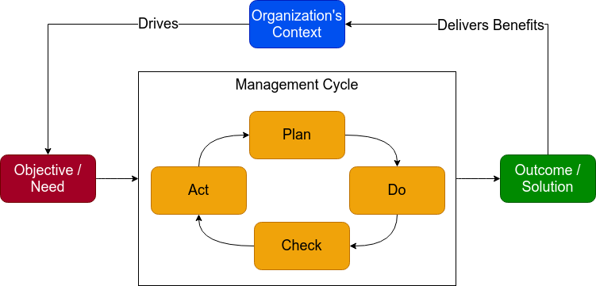
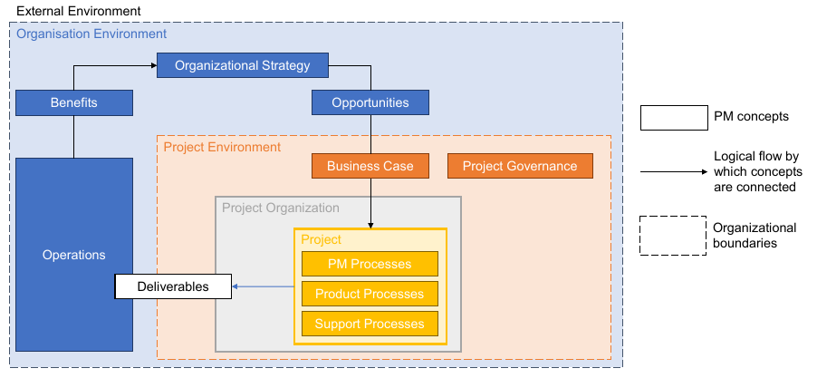

# Finland OL3 case study

## Lessons learned in Construction Project Management

### Paolo Eugenio Demagistris

---

# The Okiluoto unit 3 Nuclear Power Project

Olkiluoto 3 (OL3), currently under construction, is an EPR (European Pressurized Water Reactor) plant unit that includes modern proven technology and advanced new safety features.

---

# Time

In February 2005, the Finnish government gave its permission to TVO to construct a new nuclear reactor.

The commercial electricity production of the plant unit was originally supposed to commence at the end of April 2009. According to the latest schedule update by the plant supplier, regular production at the plant unit will begin in March 2022. 

---

# Cost

The main contractor, Areva, is building the unit for a fixed price of €3 billion, so in principle, any construction costs above that price fall on Areva. 

In December 2012, Areva estimated that the full cost of building the reactor would be about €8.5 billion.

TVO disclosed its total investment to be around €5.5 billion. Areva had accumulated losses of €5.5 billion. The total cost of the project, therefore, is estimated to be €11 billion.

---

# Current OL3 metrics

Cost variance = 11 B€ / 3 B€ = 366%

Schedule variance = (2022-2005) / (2009-2005) = 17 / 4 = 243%

### What happened?

---

# Project initiating

Olkiluoto 3 is the first EPR being constructed and it is a turnkey project offered by a consortium Areva-Siemens. Areva is responsible for the Reactor Island and Siemens for the Turbine Island.

The start of the project was very slow because the vendor was actually not adequately prepared when the construction permit was given. Parts of the detailed design and the working documents were not yet available and this hampered the planned progress in construction. It took also some time to find designers and experienced organizations for construction and manufacturing.

---

# Preparedness of the involved organizations for the new build

---

### Vendor: AREVA

The staff of Nuclear Island vendor Areva had been strongly reduced from the time of earlier construction. Especially the number of designers was too small for quick start. On the other hand Areva had large economic resources for fast growth and it was expected to have a capability for relatively quick restart of nuclear build.

---

A major drawback, although not clearly recognized at the time of signing the contract, was that Areva did not get full benefit of its earlier experience as a NPP supplier. Areva signed a turn-key contract on Olkiluoto 3 and took responsibility on Reactor Island without experienced partners and without having all needed competences. In all of Areva’s earlier projects, the owner and licensee of the French nuclear power plants EdF had played a key role of the architect-engineer and had been responsible for the construction management.

Many of the experienced nuclear manufacturers that had contributed to the earlier Areva projects had left the business. It was necessary to find new subcontractors and to coach them in the nuclear manufacturing.

---

### Owner / Licensee: TVO

TVO’s key persons had worked in expert duties during construction and commissioning of the operating units but none of them had hands-on experience from management of a large construction project. It is evident that before signing the main contract, none of the two parties, Areva and TVO, adequately appreciated the key role of an experienced construction company for the success of the project. Furthermore, it seems that TVO was not adequately aware of the limitations in the capabilities of the potential vendors and the actual status of the available designs. Target set for the construction time in the call for bids was therefore not realistic.

---

# Outcome - Construction schedule

Main reasons for the delay are

* Too ambitious original schedule for a plant that is first of its kind and larger than any NPP built earlier, 
* Inadequate completion of design and engineering work prior to start of construction, 
* Shortage of experienced designers, 
* Lack of experience of parties in managing a large construction project, and 
* Worldwide shortage of qualified equipment manufacturers.

---

# Causes - Context

In planning and scheduling new build, it is necessary to recognize that circumstances in Europe and the U.S. are quite different from the 1970’s when most of the currently operating plants were constructed.

Vendors of the 1970´s had large experienced organizations and these incorporated comprehensive in-house capability for design and manufacturing. This reduced the dependence on subcontractors, and management of the projects was more straightforward.

In the 1970’s, there was enough of skilled manufacturing capacity in the market, and the large volume of construction facilitated finding experienced project managers. 

---

Since the first era of intensive NPP construction, vendors have lost much knowledge and skills when experienced experts have retired. Today, new types of competencies are needed for new technologies such as digital instrumentation and control systems. A good company name earned in the past is no guarantee for success. More important is the experience and competence of individuals actually assigned to the project.

For starting new build, vendors need to establish a sub-contractor network from companies with proven skills. Awareness of nuclear quality and understanding of nuclear safety culture must be taught to organizations that have no previous nuclear experience. Management of work conducted by the sub-contractors is a challenge of its own.

---

# Reminder: Management cycle

---

# Management: Plan

* Investigate the current situation
* fully understand the nature of the problem being solved
* formulate the key tasks
* detail the activities to execute the task
* specify the desired outcomes and results.

---

# Management: Do

* Gather data to assess extent and specifics of tasks
* Define a coherent body of information to define activities
* Assign responsibilities and resources to activities
* Direct the execution
* Lead, monitor and control

---

# Management: Check

* monitor the effect of the implementation plan
* find countermeasures if necessary to further improve the solution
* check during implementation that the objectives are being met
* check at completion
* allow for successes and failures to be addressed
* collect lessons learned.

---

# Management: Act

* Implement your solutions and recommendations
* Decide if the solution is effective
* Integrate it into standard work practices or abandon it
* ask what you’ve learned from the process
* restart the cycle.

---

# Project As a Framework

---

# Case Discussion

