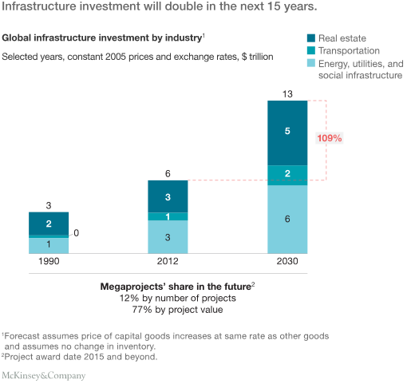
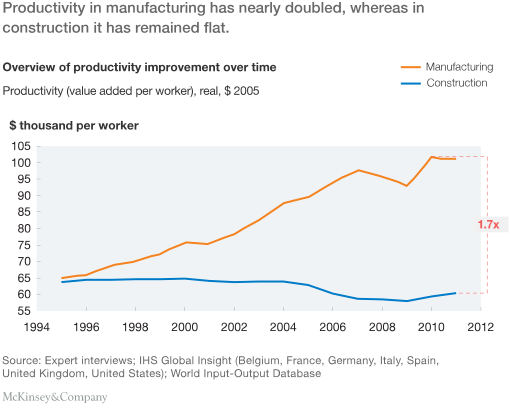
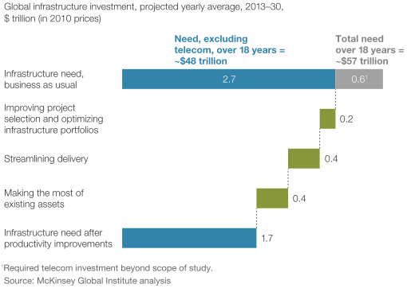
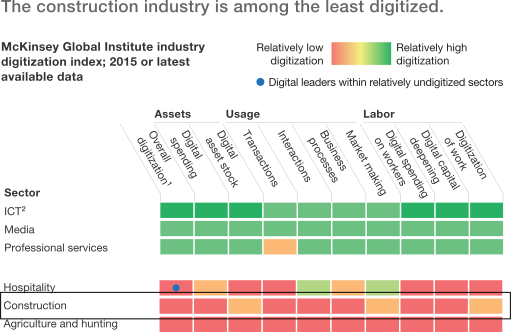
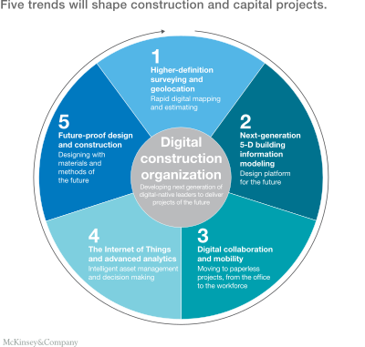
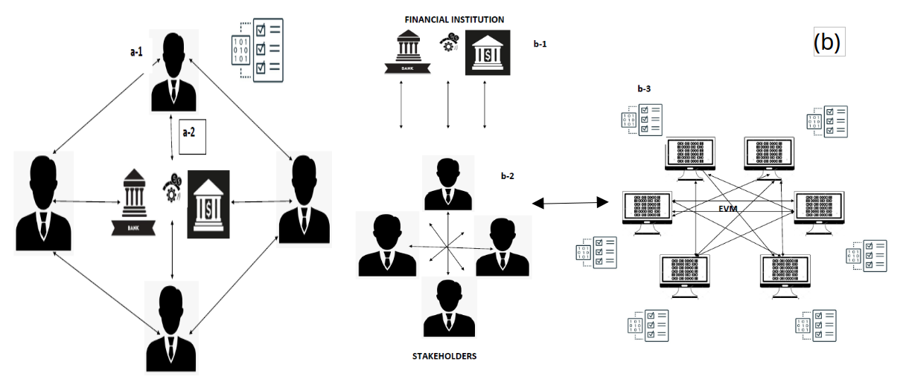
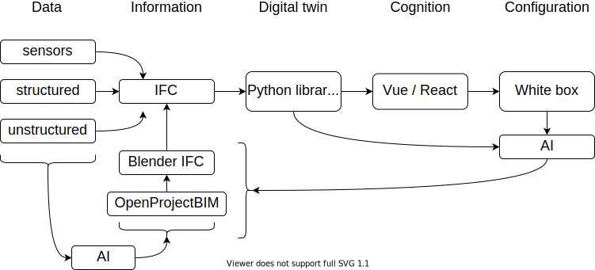

# Introduction to the Construction Project Management course

## Broad construction industry - Outlook on opportunities, challenges and threats

### Paolo Eugenio Demagistris

---

# Course Rationale

This course aims at educating the next generation of Construction industry "reflective" practitioners.

What follows is a brief outlook on the opportunities, challenges and threats they will have to face.

---

# Understanding today's Construction

>The construction industry, and its broader ecosystem, erects buildings, infrastructure, and industrial structures.
Construction is the **biggest industry in the world**, and it is not performing well. The AEC represents 13 percent of global GDP, but construction has seen a productivity growth of 1 percent annually for the past two decades. Time and cost overruns are the norm, and overall earnings (EBIT) are only around 5 percent.

McKynsey, 2020 [The next normal in construction: How disruption is reshaping the world’s largest ecosystem](https://www.mckinsey.com/business-functions/operations/our-insights/the-next-normal-in-construction-how-disruption-is-reshaping-the-worlds-largest-ecosystem)

---

# Industry dynamics

---

# Productivity gap

---

# Effects of possibile improvements

---

# Digitalization

---

## Digital transformation

---

# Digital transformation

Higher-definition surveying and geolocation

Next-generation 5-D building information modeling

Digital collaboration and mobility

The Internet of Things and advanced analytics

Future-proof design and construction

---

# Areas of advanced CPM research @ PoliTO pm-lab

* Digital governance by tokens and smart contract
* Construction 4.0

---

# Digital governance by tokens and smart contract

---

# Construction 4.0

