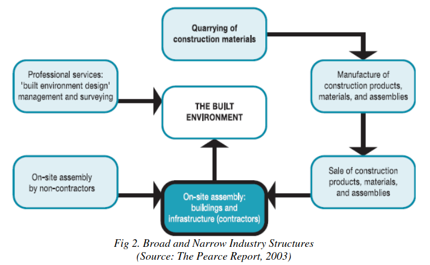
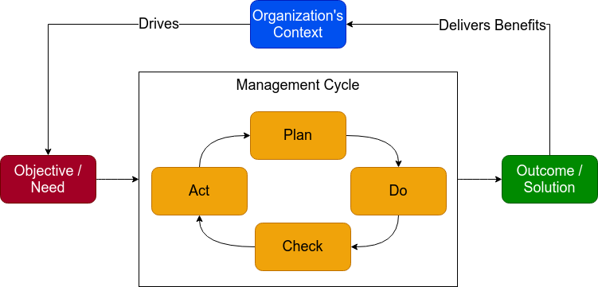
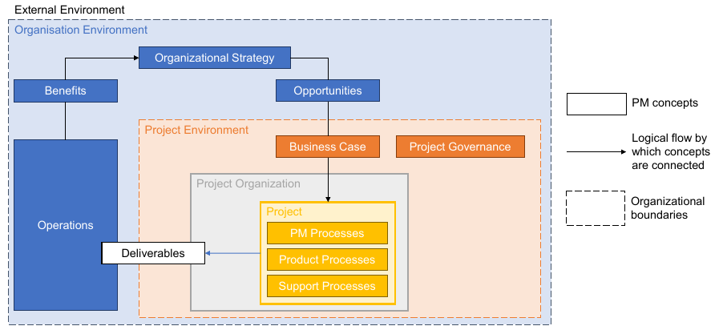
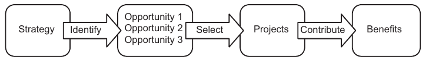
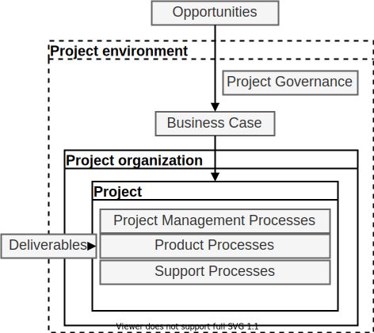
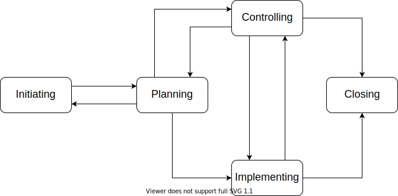
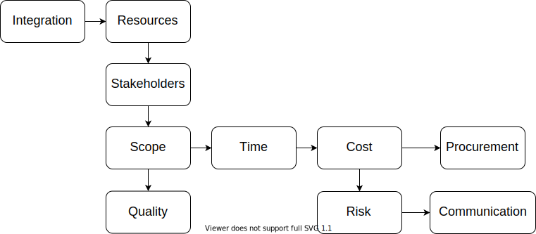
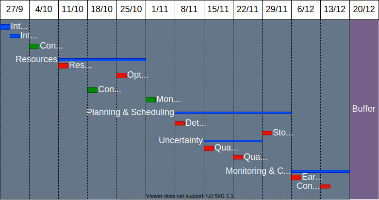

# Introduction to Construction Project Management (CPM)

### Paolo Eugenio Demagistris

---

# Construction Management definition:

* a practice of professional management applied to the AEC context

* applied to the planning, design, and construction of projects
* from inception to completion
* for the purpose of controlling time, scope, cost, and quality

## application of integrated systems and procedures by a team of professionals to achieve the owner‘s goals

---
# Construction project management

The main function of Construction Management

Based on generic PM standards, such as ISO21500:2012 (used throughout this course), ISO21502:2020, PMI PMBoK, IPMA ICB4, defined by

> project: temporary endeavour to achieve one or more defined objectives
> 
> project management: coordinated activities to direct and control the accomplishment of agreed objectives

> *from ISO 21502*

---

# Construction Project Management

## Breaking down the terms:

AS we are going to spend many weeks describing systems and procedures that apply to CPM,

The next slides are aimed at clarity on what we mean by each term.

---

# Construction

---

# Thus, two perspectives for the Construction

The  **narrow  sector**:

* solely *on-site  assembly*  including:
  * site  preparation,
  * constructions  of  buildings  and  infrastructure,  
  * building  installation  and  building  completion  (decoration).

The **broader definition** includes:

* the supply chain for construction related  products
* the professional  services  such  as management,  architecture,  design  and  facilities  management. 

---

# Management

Management’s primary function is 
* to get people to work together 
* for the attainment of an organization’s goals and objectives
* using available resources efficiently and effectively

Organizations are systems, management is a supervisor, defined as:
>human action to facilitate the production of useful outcomes from a system.

---

# Management cycle

---

# Management: Plan

* Investigate the current situation
* fully understand the nature of the problem being solved
* formulate the key tasks
* detail the activities to execute the task
* specify the desired outcomes and results.

---

# Management: Do

* Gather data to assess extent and specifics of tasks
* Define a coherent body of information to define activities
* Assign responsibilities and resources to activities
* Direct the execution
* Lead, monitor and control

---

# Management: Check

* monitor the effect of the implementation plan
* find countermeasures if necessary to further improve the solution
* check during implementation that the objectives are being met
* check at completion
* allow for successes and failures to be addressed
* collect lessons learned.

---

# Management: Act

* Implement your solutions and recommendations
* Decide if the solution is effective
* Integrate it into standard work practices or abandon it
* ask what you’ve learned from the process
* restart the cycle.

---

# Project As a Framework

---

# Project Framework explained

* The broad **external environment** drives the existence of an organization
* The **organization environment** is setup to deliver **benefits** to organization's stakeholders
* benefits are created by **operations**, that are defined as:
* >business operations: collectively, everything that happens within a company to keep it running and earning money.
* **Benefits** are sustained by **organizational strategy**
* strategy defines **deliverables** that are needed and implemented to sustain operation's benefits  delivery.

---

# Organizational strategy

* a master plan, such as a portfolio of projects
* charting the course of action of organization's executives
* based on a set of decisions
* to achieve the organization's objectives, that are
  * secure a competitive position in the market
  * carry on its operations
  * please customers
  * deliver organization's intended benefits, mission, vision and values

---

# Formation of strategy

* Opportunities are identified and evaluated through environment intelligence
* Management selects the opportunities that could deliver benefits
* Opportunities are new environment features that impact on the organization, eg.:
  * new market demand
  * current operations' need
  * new legal requirement

---

# Formation of a project

---

# Business Case

* A project environment is created if there is a **Business Case** for it
* Business Case is a methodology to evaluate if the opportunity is feasible, ie.
  * Benefits are higher than costs, financially and socially
  * Impacts are coherent with organization's values and overall strategy
* It's a project Master Plan: the course of action is defined and evaluated
* A Project Sponsor is named, responsible for the business case and accountable for project goals and benefits

---

# Project Governance

* A framework to direct the project organization to achieve the Business Case
* Project governance includes:
  * Mechanisms to define the management structure
  * policies, processes and methodologies to be used
  * limits of authority for decision-making
  * stakeholder responsibilities and accountabilities
  * interactions such as reporting and the escalation of issues or risks
  
The responsibility for implementing project governance is assigned to the project sponsor or to a project steering committee.

---

# Project Organization

Designing, implementing, improving the processes happening between **stakeholders** to execute the project deliverables

* According to Business Case goals, ie. Achieving the benefits expected from the opportunity 
* According to Deliverables requirements as stated in the Business Case

**Stakeholders** are defined as:
>person, group or organization that has interests in, or can affect, be affected by, or perceive itself to be affected by, any aspect of the project

**They include all project operatives.**

---

# Project's Groups of processes:

* Deliverables are constructed, in the narrow sense, by **Product processes**, such as pouring concrete, setting out foundations, etc.
* Product processes are orchestrated by **Project Management Processes**, as the production must be coordinated with:
  * the Business Case and the environment, both external and organizational
  * the Stakeholders
  * the constraints (time, quality, money)

---

# Product vs. PM processes

Stakeholders perform work to contribute to the project. This work is either Product or Project related.

### Product processes
* are performed by relatively stable teams through ongoing and repetitive processes
* are focused on sustaining the organization

### Project Management processes
* are performed by temporary teams so are non-repetitive
* provide unique deliverables

---

# Construction project deliverables

In construction project deliverables are composed of many built elements. A taxonomy of deliverables can be found in OmniClass, Table 21 - Elements, defined as:
>An Element is a major component, assembly, or “construction entity part which, in itself or in combination with other parts, fulfills a predominating function of the construction entity.

---

# OmniClass, Elements, Table 21

Example

#### 21-02 00 00 Shell

* 21-02 10 Superstructure
  * 21-02 10 10 Floor Construction
    * 21-02 10 10 10 Floor Structural Frame
* 21-02 30 Exterior Horizontal Enclosures
  * 21-02 30 10 Roofing
    * 21-02 30 10 70 Canopy Roofing

---

# Construction product processes

In construction many product processes are executed. A taxonomy of these products can be found in OmniClass, Table 22 - Work Results, defined as:
>Work Results are construction results achieved in the production stage and identified by one or more of the following:

>* the particular skill or trade involved;
>* the construction resources used
>* the part of the construction entity which results.

---

# OmniClass, Work Results, Table 22

Example

#### 22-03 00 00 Concrete
* 22-03 11 00 Concrete Forming
  * 22-03 11 13 Structural Cast-in-Place Concrete Forming
    * 22-03 11 13 13 Concrete Slip Forming
* 22-03 31 00 Structural Concrete
  * 22-03 31 23 High-Performance Structural Concrete

---

# Project life cycle

As projects are **temporary** they only span a determined life cycle.

They are constrained by a start and an end, both defined in the Business Case, monitored through the Project Governance mechanisms.

The life cycle is broken into stages:

* to allow for intermediate monitoring.
* defined by partial deliveries using resources
* are sequenced and time related.

---

# Project Management Processes

* Purpose: orchestrate production processes to deliver within project constraints
* To be designed based on recognized body of practice, taylored to project need
* Addressing project complexity through proper coordination among them
  
---

# PM Processes Groups

---

# Initiating

* formally start a project, 
* define the project objectives and constraints through a high level project plan
* authorize the project manager to proceed with the project work.

# Planning
* develop planning detail
* establish baselines to drive and monitor product processes
* allow project implementing and controlling

---

#  Implementing

* direct product processes according to baselines 
* support product processes toward provision of deliverables

# Controlling

* monitor, measure and control project performance against the project
plan. 
* take preventive and corrective actions
* make change requests to product processes to achieve project objectives.

---

# Closing

* formally establish that the project phase or project is finished
* provide lessons learned to be considered and implemented as necessary

---

# PM processes by subject

---

#  Integration

identify, define, combine, unify, coordinate, control and close the various activities and processes

# Resource

identify and acquire adequate project resources
people, facilities, equipment, materials, infrastructure and tools.

---

# Stakeholder

identify and manage the project sponsor, customers and other stakeholders

# Scope
identify and define the deliverables and the work required.

# Quality

plan and establish quality assurance and control

---

# Time

schedule and control the project activities timing, monitor progress

# Cost

budget and control the project activities spending, monitor progress

# Risk

identify and manage threats and opportunities

---

# Procurement

plan and acquire products, services or results, manage supplier relationships

# Communication

plan, manage and distribute information relevant to the project

---

# CPM as Business Process Management (BPM)

A business process is 

* a collection of linked tasks 
* that find their end in the delivery of a service or product to a client. 

A business process has also been defined as
* a set of activities and tasks 
* that, once completed, will accomplish an organizational goal. 

The process must involve clearly defined inputs and a single output. 

---

# Business Process

A business process includes at least one of, but not limited to, the following elements:

* task/ activity
* system
* employee(s)
* workflow
* data

---

# Features of a Business Process

Key attributes that distinguish business processes from other business tasks and activities are: 

* a process is repeatable
* a process is flexible and not rigid
* a process is specific and has established start and endpoints
* a process is measurable

---

# Processes vs. Projects

A project is focused on creating something new or implementing a change

A process is focused on creating value by repeatedly performing a task.

Simply put, projects are activities that you have never performed in your business before, whereas processes are activities that you do repeatedly.

---

# Processes vs Procedures

A process is a flow of business activities that are connected toward the achievement of a business outcome,

Whereas a procedure is a prescribed way of undertaking a process or part of a process. 

While a process is a set of defined actions, a procedure is a set of instructions that are detailed in nature.

---

# Introduction to CPM: key take aways

* Construction delivery is basically about delivering a project, as
  * Each construction is unique
  * Construction happens along a life cycle, with a start and an end
  * Construction is uncertain by nature and CPM is used to deal with this
* CPM is a collection of processes to effectively deliver value to Construction Owner, by enabling its benefit realization through improved operations.

---

# Introduction to CPM: key take aways (cont.)

* Construction is based on a Owner driven strategic business case that leverages on opportunities to deliver benefit realization
* CPM is about
  * Governing the project
  * Designing and executing PM processes
  * That orchestrate through baselines and control
  * Product processes that
  * Actually produce the elemets that form the deliverables

---

# The CPM course

---

# Introduction to Project planning

Learn the basics to interact with MsProject

---

# Contract Organization

Construction Project governance through Owner / Contractor(s) / Subcontractors agreements and contracts

Higher-level portions of the project scope: financing, design and development

Delivery systems, contracting mechanisms

Risk-sharing and incentive issues

Payment mechanism, award methods. 

Forming a Construction contract

---

# Contract Administration

Contract administration during project planning and execution phases.

Handling bids and proposals

Main provisions and clauses: bonds, changes, claims and dispute resolution.

Recording and reporting.

---

# Resources

### Resourcing

Construction is managed by a group of people and delivered allocating material resources. 

Designing an effective management organization.

Allocating resources

### Optimization

Allocating resources in systemic ways to maximize efficiency and effectiveness

---

# Money

Cash made available to sustain Construction capital investment, is a major concern and constraint throughout the life-cycle of a construction project.

Business Case based on evaluation of project profitability.

Funding opportunities, capital structure as a mix of equity and debt funds

Forecasting cash streams, monitoring to estimate the actual completion time and final cost

Deciding and making corrective actions

---

# Planning and Scheduling

### Deterministic

Basics of structuring breakdowns of project activities (WBS and CBS)

Principles applying to deterministic scheduling process

Standard scheduling documents, primary scheduling methods

### Stochastic

Treating scheduling metrics as statistic variables: implications and methods

---

# Project Monitoring and Control

### Earned Value Method

Dealing with discrepancies in expenditures, productivity and speed of work

Method for measuring the actual progress of work. 

Earned Value Analysis, estimating the cost and schedule at completion.

### Control

Decision making and control actions to bring the project back on track 

---

# Uncertainty

Uncertainty exists in Construction with regard to a variety of issues.

Methods to take uncertainty and risks into consideration.

Scheduling and budgeting under uncertainty

Managing uncertainty causes and impacts, Risk Management

Qualitative and semi-quantitative approach

Quantitative approaches

---

# Question and Answers

---

# Thank you and see you soon!

