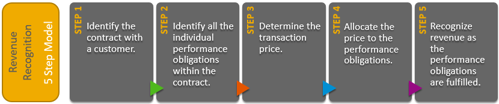
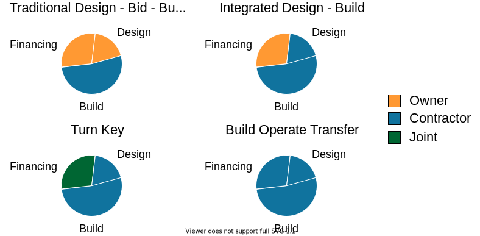
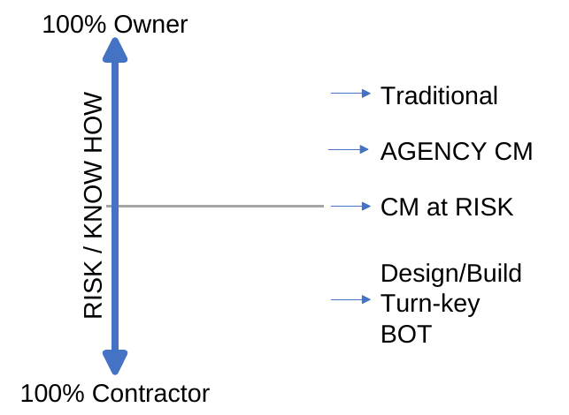
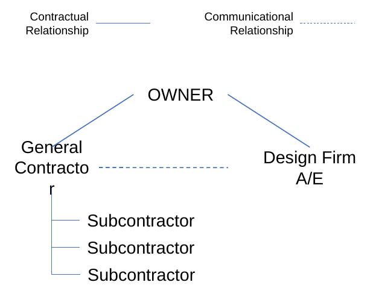
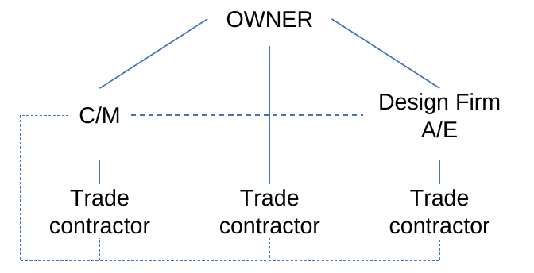
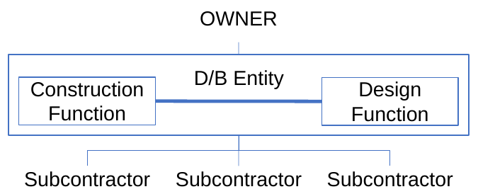

# 01 - Contract Organization

### Paolo Eugenio Demagistris

---

# Contract Organization - Outline

Construction Project governance through Owner / Contractor(s) / Subcontractors agreements and contracts

Higher-level portions of the project scope: financing, design and development

Delivery systems, contracting mechanisms

Risk-sharing and incentive issues

Payment mechanism.

---

# Construction Project Governance through Contracts

### What is a contract? Specific legal meaning.

A contracts is an agreement that has key characteristics:
* specific terms;
* between two or more people or entities;
* there's a promise to do something, 
* for what lawyers call valuable consideration.

---

# Why a Contract?

Can't the Owner's organization arrange to deliver Construction Processes without a Contractor?

Ronald Coase, “The Nature of the Firm” (1937): why individuals choose to form business organizations rather than trading bilaterally through contracts on a market.

Organizations exists as far as they are better equipped to deal with the **transaction costs** inherent in production and exchange than individuals are.

A contract exists when the costs of dealing with it are less than the cost of setting up an organization.

---

# Contract as Social Construct

Project governance as related to the Contingency theory, whereby

* Organisations are 'open systems' that react to their environment in order to survive, changing their structure upon environment features and dynamics (environment variables)
* Contracts, that are enforceable by jurisdiction, are an additional variable, that moderates the impact of others.

---

# Defining the problem

Construction contracts grant the Parties participants certain rights, with regard to delivery and payments.

As a "social" construct if society members fail to recognize those rights, the right ceases.

Their interpretation, execution, and enforcement rely only on human agreements and the collective intentionality of project participants.

---

# Defining the problem

## Strategic misrepresantions

In the execution of a contract either parties tend to suppress objectivity to "sell" and "close" the project

---

# Defining the problem

## Optimism Bias

We are mostly conservatives. When we embrace a project, that is we assume a risk, we tend to suppress risk aversion signals.

---

# Moderating the contingency theory

### Traditional "legal" approach: 
Construction "brute facts" are istitutionalised into legally enforceable norms

### Innovative financial approach: 

contracts transform product flows into "cash" (financial) flows

---

# Understanding Contracts - Follow the money...

The IFRS 15 Revenue from Contracts with Customers. The five steps model

---

# 1 - Identify the Contract

## Form

Typical: where Civil Law already provides for the jurisdictional constructs

Atypical: where the Conditions set by the Parties define the whole of the jurisdictional construct

---

# 2 - Identify the performance

## Nature

Obbligation to GIVE: supply, sale, simple transaction

Obbligation to DO: typical for Construction, complex transaction

---

# 2.a Scoping the contract

### Financing: 

* securing the money required to finance the project
* devising a strategy to reimburse money through project's operational profits.
  
### Design:

* Detail the project scope, from broad concept, to construction drawings 

### Build:

* Performance of onsite works, including supply-chain activities.

---

# Scoping > Delivery System

---

# 3 - Determine the price

$$
P=k*\sum C_{i}+RiskPremium\\
where\\
P = Price\\
k = f(ProfitMargin)\\
C_i=[DirectCosts,IndirectCost, Interest On Capital]\\

RiskPremium=\Delta_U(\sum C_i) = G(Uncertainty)
$$

---

# Uncertainty cone (Bohem, 1981)

---

# Nature of Uncertainty

* Stochastic nature of context variables
* First-of-a-kind (FOAK) effect
  * Innovative project, or
  * Immaturity of either party
* Technique: assign uncertain portion of scope to the most mature party

---

# Delivery system dictates the risk allocation:

* The more the Contractor has to do, the more he is considered competent, and, skilled in doing the portion ofthe scope
* the Owner should leave risk on Contractor’s shoulders, as better fitted to deal with uncertainty

---

### Delivery system dictates the risk allocation:

---

# Delivery systems > Organizations

1. Traditional
2. Construction Management (CM)
3. Design/Build
4. BOT

---

# Traditional

---

# Contruction Management (CM)

---

# Design/Build

---

# 4 - Allocate the Price to Performance

1. Time&Material
2. Unit Pricing
3. Cost Plus
4. Lump-sum Turn-key Payment

---

# Time & Material

The Owner pays the Contractor the price agreed in the contract for:
• Labour employed
• Materials used and assembled
• Capital goods and construction site accessories

### The risk of higher costs is on the client

---

# Unit Pricing

Once works are defined, unit prices are agreed for each individual category of work.

The Owner pays the quantity of work categories actually made by the Contractor, at established times or work progress rates

---

# Cost-plus

Similar to Time&Material, based on billed direct costs.

The Contractor's Profit Margin is declared as a Fee.

The fee can be related to the performance of the project, in a way to incetivize the Contractor to deliver within agreed baselines.

---

# Lump-sum Turn-key Payment

Flat rate, often upon delivery of the work, but they can be advance payments and interim payments agreed upon achievement of partial milestones, corresponding to System made "ready“ to work

The contractor is the manager of all phases of the project – EPC Engineering, Procurement, Construction.

The Contractor is the single interface of the Owner

The price generally has the possibility to be revised

---

# Additional Price Components:

**Bonus / Malus**: application of Price variation clauses depending on performances on specific requirements

**Penalties**: sums to be deducted from Price in case of failure to comply with certain contractual requirements

**Liquidated damages**: conventional sums representing Owner damages occurring as a consequence of Contractor failure to comply with certain contractual requirements

---

# Question and Answers

---

# Thank you and see you soon!

