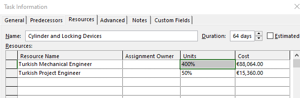

# 02-1 Resourcing a Construction Project

### Paolo Eugenio Demagistris

---

## Resourcing > Today Lecture

Construction is managed by a group of people and delivered allocating material resources.

Designing an effective management organization.

Allocating resources

---

## Resourcing > Organizational Challenge

* The contract defines roles and responsibilities of the parties, financial relationships and rules for project execution.
* Operatives execute tasks.
* Management makes decisions, document, direct, and control the project.
* The quality and effectiveness of their interactions can make or kill the project.
+ Persons involved in the project effort act according to the environment designed by the Contracting Parties.

---

### Org.Challenge > Top down approach

The Business Case is implemented through Governance.

Governance is implemented through Contracts.

Contracting Parties delegate to their Organization.

Persons in  the Organization are empowered and allocated according to an Organizational structure, that defines the distribution of Authority, Power and Control.

**Thus resourcing the Project.**

---

### Org.Challenge > Bottom up Approach

#### WBS / ResBS matrix

In traditional CPM we have

$$

UnitsRequired_{resource}(t)= \sum_{1}^{activity(t)}{assignment_{(activity,resource)}}\\

\\

\left [ UR(t) \right ] = \left [ assignment \right ]\cdot \left [ activity(t) \right ]
$$

---

#### BottomUp > Resource Assignment

---

#### BottomUp > Resource Allocation

---

### Org.Challenge > Reading

A. De Marco, Project Management for Facility Constructions, Second Edi. Springer International Publishing, 2018
§ 4.1 The organizational challenge

---

## Resourcing > Organizing for PM

Finding an optimum balance based on the level of interface between the project and its parent organization.

* The parent organization is designed for efficiency: max revenue for min resources
* The project environment requires effectiveness: max deliverables within project's constraints

---

### Org. for PM > Tipycal structures

---

### Org. > Functional Organization

Management dispatches project processes to functional units.

No real PM as Line management coordinates activities

---

### Org. > Project Task Force

Management creates a child separate company

A PM is fully responsible for the project development with the assistance of a full-time project team.

---

### Org. > Matrix

A blend of the two main structures

Must be balanced to mitigate Project and Functions management conflicts of objectives

A resource must report to two managers.

---

### Org. the Firm > Reading

A. De Marco, Project Management for Facility Constructions, Second Edi. Springer International Publishing, 2018
§ 4.2 Organizing the firm for Project Management

---

## Resourcing > Organizing the Project Team

In projects, different professionals are needed to support the PM in performing various tasks.

Key activities of the PM are:

* design the project team; 
* get the right persons for the various jobs; and 
* build up and motivate the team to enhance project performance

---

### Org. PT > Structure

Design the structure using a Process / OBS matrix

Record for each member the RACI attributes to ensure coordinationation of management, operational and information flows

R: responsible, A: accountable, C: consulted, and I: informed

---

### Organizing the Project Team > Reading

A. De Marco, Project Management for Facility Constructions, Second Edi. Springer International Publishing, 2018
§ 4.3 Organizing the Project Team

---

## Resourcing > the Project Manager

The PM is to make decisions, plan and control uncertainty to bring the project the most as possible in line with the Business Case.

But, overall, the PM’s first aim and concern is to direct all people involved in the project challenge.

PM is required to have comprehensive experience, knowledge of human behaviors, psychology, leadership attitudes, communication skills, and knowledge of the disciplines required for Product processes

---

### PM > the 3R/3C framework

PM to:
* establish virtual contracts that assign precise roles and charge each team member with strict responsibilities.
* build up a collaborative environment

As a consequence, individuals would be able to do their assigned tasks within the time allotted, and quickly report unanticipated problems, resulting in a successful whole project.

---

### the Project Manager > Reading

A. De Marco, Project Management for Facility Constructions, Second Edi. Springer International Publishing, 2018
§ 4.4 People and the Project Manager

---

## Resourcing > Other Approaches

### Reading
A. De Marco, Project Management for Facility Constructions, Second Edi. Springer International Publishing, 2018
§ 4.5 Agile values, principles and teams
