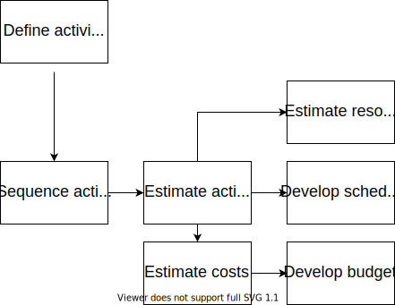

# 02-1 Optimizing Resources for a Construction Project

### Paolo Eugenio Demagistris

---

## Resourcing > Today Lecture

Allocating resources in systemic ways to maximize efficiency and effectiveness

---

# Process view

ISO21500:2012

Figure A.2 — Planning process group processes

---

# Limits of Scope - Time - Cost Scheduling

The process flow above is informed by the traditional Scope - Time - Cost approach.

Typically:

- Deliverables dictate scope
- Scope dictates activities newtwork
- Activities have a determined duration and cost
- Resources are defined to fullfill scope timing and cost requirement

This approach is valid only for high level scheduling and should be used only for setting targets.

---

# Nature of activities' duration and cost

Duration = total work / allocated resources units

Cost = total work * resources rate

---

# The Economics perspective

Defining economics

One of the founding fathers of economics, Alfred Marshall, advised as follows:

>Every short statement about economics is misleading (with the possible exception of my present one).

Nevertheless, definitions are a useful place to begin. A standard definition of economics could describe it as:

>a social science directed at the satisfaction of needs and wants through the allocation of scarce resources which have alternative uses

---

# Resources optimization - Learning by doing

Use the files uploaded:
* 02-02-01-CostBreakdown.xlsx
* 02-02-02-prjBase.mpp
* 02-02-03-prjOpt.mpp

Follow the recording of the lecture. 

---

# Benefits of the proposed approach

We have optimized the resources allocation profiles
* Reduced idle times of expensive resources
* Reduced overall duration and therefore
* Reduced total overhead and impact of "daily" indirect costs

We have not increased direct costs!

---

# Limits of the proposed approach

We have not considered the specific nature of tasks

* there are **fixed duration** tasks, ie. concrete curing
* there are **fixed units** tasks

Read more at https://support.microsoft.com/en-us/office/change-the-task-type-for-more-accurate-scheduling-b0b969ad-45bc-4e9e-8967-435587548a72

---

# Limits of the proposed approach

We have not considered the effect of resources congestion and diminishing marginal utility of additional resources.

---

# Mandatory Reading

A. De Marco, Project Management for Facility Constructions, Second Edi. Springer International Publishing, 2018
§ 7.6 Resource-Based Scheduling

