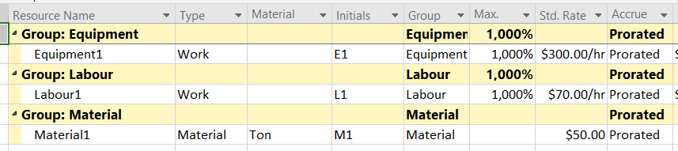
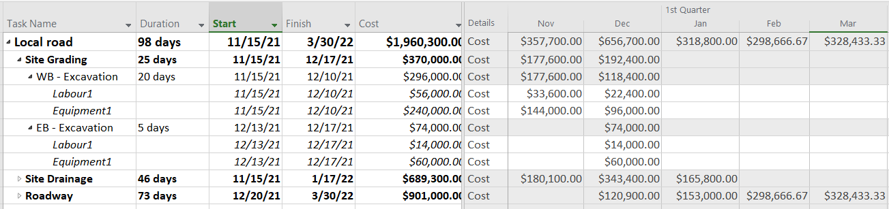

# 05-2 Budgeting a Construction Project

## Direct vs Accounting approach

### Paolo Eugenio Demagistris

---

## Scheduling > Today Lecture

### Budgeting

Basics of structuring breakdowns of project costs (CBS)

Costs and their underlying financial transactions

The Owner perspective

The Contractor perspective

---

## Budgeting > Organizational Challenge

* The project environment needs a detailed budget showing the estimated **line costs** of the project activities to establish the overall project baseline of total cost allocation.
* While the Owner (Client) needs only to allocate the contract price to contractor agreed performance, the Contractor must align those allocations to their accounting cycle.
* Both parties need a common rule to recognize transactions to be recorded in their respective accounting system

---

### IFRS 15 Revenue from Contracts with Customers. The five steps model

1. Clarify the contract: mechanism, parties, terms and obligations
2. Identify the deliverables as product performances
3. Determine the price as a function of performances costs and context
4. Identify the product flow (CBS = WBS)
5. Associate transactions to product flow = financial flow

---

---

### Budgeting - Identify performances

The performances are identified using a hierarchical structure that breaks down the project expected deliverables.

If the WBS is structured with the functional / built elements approach the performances are identified by Work Packages to be rendered by the Contractor(s)

The hierarchical structures details:

* the main functions to be delivered by the projects
  * the main sub-functions that interact to deliver the function
    * The elements that form the subfunctions architecture
      * the sub element that build the elements

---

---

### Function: Local road
* **S/Function:** Site grading
  * **Element**: Excavation
    * **S/Element:** Top soil removal
    * Open section to grade
  * Back fill
    * Cut and fill
* Site drainage
  * Culvert
* Roadway
  * Foundation
  * Paving

---

### Budgeting - Price

Determining the costs to price(s) is done through the Cost Breakdown Structure (CBS). 

The CBS is a system for dividing project costs into cost accounts, typically: 

* Direct costs: labor, materials, equipment rental. 
* Indirect costs (Overheads): support staff, site maintenance materials, facilities, headquarter costs allocated to the project 

---

### Budgeting - Allocating Price fractions to Performances

* The costs detailed according to the CBS are allocated to the WBS items
* **According to the Contracting Mechanism**
* As WBS elements are time-controlled also the budget transactions are time related.
* This allows for monitoring costs along the project lifecycle

---

### Budgeting - Recognizing transactions when performances are rendered

* Have a quality control group of processes to recognize rendering of performances
* Record contract / project cost transactions at the time when performance are rendered

---

### Budgeting - Contractor perspective

* Define CBS items as resources
* Allocate resources to task
* The scheduling system calculates cost
* Report Aggregation of costs according to WBS

---

---

---

# Practice

Let's switch to msproject and excel

use files 
* 05-02-CS.mpp
* 05-02-budgetCF.xlsx

---

### Accounting basics

https://youtu.be/yYX4bvQSqbo

---

### Network diagramming > Reading

A. De Marco, Project Management for Facility Constructions, Second Edi. Springer International Publishing, 2018:
§ 7.1.3.Cost Breakdown Structure–“How Much”
