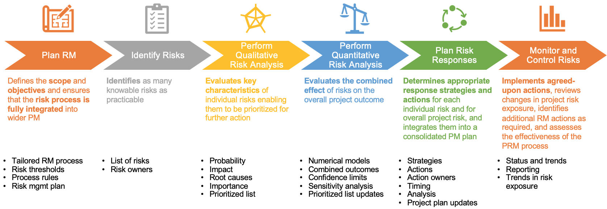
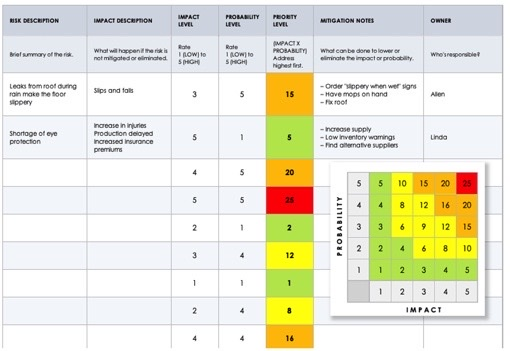

# 06 - Risk Management

### Gabriel Castelblanco

---

# Risk Management - Outline

Project Risks Management Definition
Risk identification - risk breakdown structure 
Risk quantification 
Contingency budget 
Risk plans and contingency management

---

# Risk Management - Process Groups

---

# Risk Management - Definitions

* Project risk = ***uncertain*** event that, if it occurs, has a positive or negative ***effect on a project’s objectives*** 

* Project Risk Management (PRM)= planning, identifying, analyzing, responding, and monitoring project risk

---

# Risk Management - Definitions

***Two key dimensions of risk to assess its importance:***
* Uncertainty / ***probability*** / likelihood					***ℙ***
* Effect / ***impact*** / consequence on a project’s objectives 		***𝐼***

***PRM objectives:***
* Increase the probability and impact of positive events
* Decrease the probability and impact of negative events in the project 
* Identify and prioritize risks in advance of their occurrence
* Provide action-oriented information to project managers 

---

# Risk Management - PRM Processes

---

# Risk Management - Plan

RM planning should: 
* Establish the type and level of risk detail to be addressed 
* Risk register for recording risk-related information
* Establish the effort and the frequency of the PRM processes
* Specify the project’s RM roles and responsibilities 
* Define the expectations for senior management and project personnel

---

# Risk Management - Risk Identification

The main output from the Identify Risks process is the risk register, this includes: 
* Risk description and the nominated risk owner for each risk
* Information on the causes and effects of the risk,  trigger conditions, preliminary responses

---

# Risk Management - Risk Identification
***Inputs***
* ***Project Considerations:*** Type of constructed facility, project objectives, project requirements, constraints and limitations, and surrounding site conditions, etc. 
* ***Management system:*** Methods, tools and practices. 
* ***Stakeholders context:*** Developers, landlords, construction/project managers, contractors, subcontractors, material providers, etc. 

---

# Risk Management - Risk Breakdown Structure

A RBS allows to identify risks in a hierarchical structure, similar to a WBS. 
RBS can be used in conjunction with the “what if” analysis to determine potential sources of risk and risk events. 
The set of risky causes is initially split in ***risk types***; each type is in turn subdivided into ***classes***, which are further decomposed into ***groups***, ***sub-groups***, and so on down to the basic elementary risky event

---

# Risk Management - Risk Breakdown Structure

---

# Risk Management - Risk Breakdown Structure

Identifying risks requires a matrix ***relationship between risks and the WBS*** activities that can be impacted

---

# Risk Management - Risk Analysis 

* Assess and evaluate characteristics of individually identified project risks 
* Prioritizes risks based on agreed-upon characteristics

Qualitative risk analysis evaluates 
* The probability that each risk will occur 				ℙ
* The effect of each individual risk on the project objectives	𝐼

It does not directly address the combined effect of potential interactions between risks

---

# Risk Management - Risk Analysis

***Semi-qualitative approach***

---

# Risk Management - Risk Analysis

***Example***

Two construction activities where: 
* Task 1 results in the fatality of a worker (p = 1/1,000,000) (I= $10 million) 
* Task 2 results in the loss of a limb (p = 1/ 100) (I= $100,000).

The severity can be calculated as:
* R (task 1) = 1/1,000,000 * $10,000,000 = $10 
* R (task 2) = 1/100 * $100,000 = $1000 

---

# Risk Management - Risk Analysis - Quantitative Analysis

***Objective =*** numerical estimate of the effect of risk on the objectives of the project

***Results →***
* evaluate the ***likelihood of success*** in achieving project objectives
* estimate ***contingency reserves for time and cost*** that are appropriate to the risks and project stakeholders risk tolerance 

---

# Risk Management - Risk Analysis - Quantitative Analysis

***Example of definitions of Probability and Impact***

---

# Risk Management - Risk Analysis - Quantitative Analysis - Data Analysis - RBM

***To calculate the Contingency budget estimation (Capstone)***

---

# Risk Management - Risk Analysis - Quantitative Analysis - Contingency

The ***contingency reserves*** are incorporated as follows:
* quantitative project cost	→	cost estimate 
* schedule risk analysis 	→	schedule

To provide for the capture of opportunities 
* if exceed the time or resources available, changes in the project scope and plan may result
* the amount of contingency reserve required to provide the necessary level of confidence may provide more or less urgency to risk response 

---

# Risk Management - Risk Response

Determines effective response actions to  
* the priority of the individual risks 
* the overall project risk

***Purpose =*** to determine the set of actions which most enhance the chances of project success while complying with applicable organizational and project constraints

---

# Risk Management - Risk Response - Strategies

---

# Risk Management - Risk Response - Strategies

***Avoid*** to ensure either that  ***(1)*** the threat cannot occur or can have no effect on the project 

***Transfer*** to a third party that is better positioned to address a threat 

***Mitigate*** to decrease the probability and/or the impact of a threat

***Accept*** When other strategies are not considered applicable or feasible.
Entails taking no action unless the risk actually occurs

---

# Risk Management 

# Risk Response Plan

---

# Risk Management - Contingency Management

Contingency funds are usually estimated at the project planning phase and ***included in the original budgets as escrow accounts*** to be used as a flexibility to manage uncertainties and risks that ***may deviate the project from its original time, cost, and quality*** objectives. 

Risk contingency budgets need to be revised as a continuous and dynamic management process ***not only as future cost for unforeseen events, but also as potential opportunities for releasing the unspent contingency as a profit*** or as added improvements to the constructed facility.

Project managers can choose between a risk preventive vs. a more risk reactive strategy. 
Experience and empirical evidence has proved that a risk preventive proactive strategy may prove itself to be a recommended tradeoff for managing the contin- gency budget process along the project development. 
