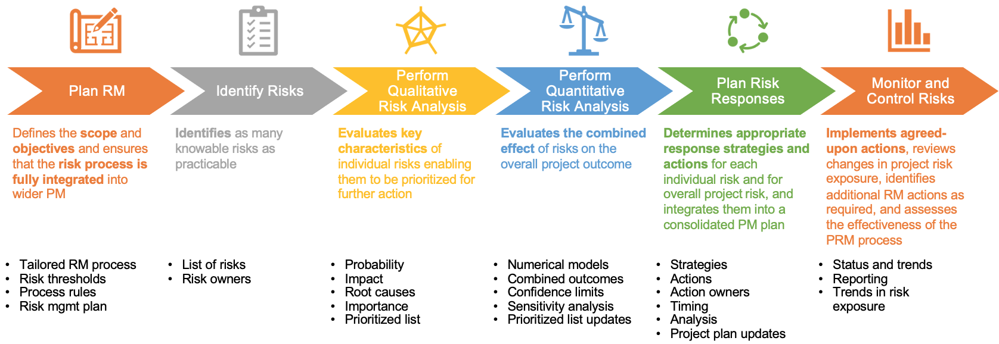
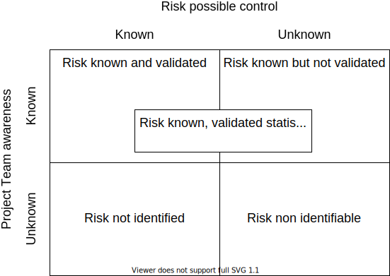
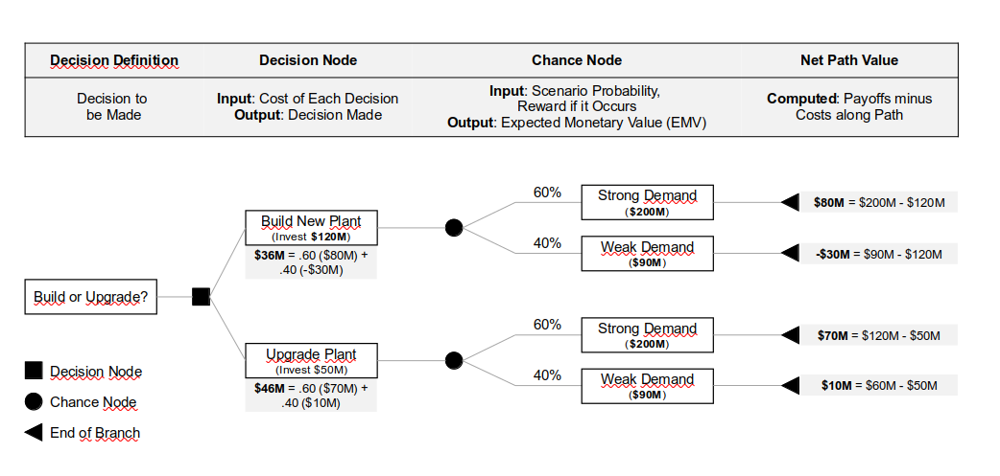
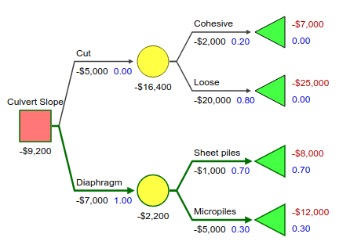
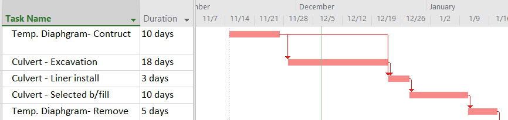
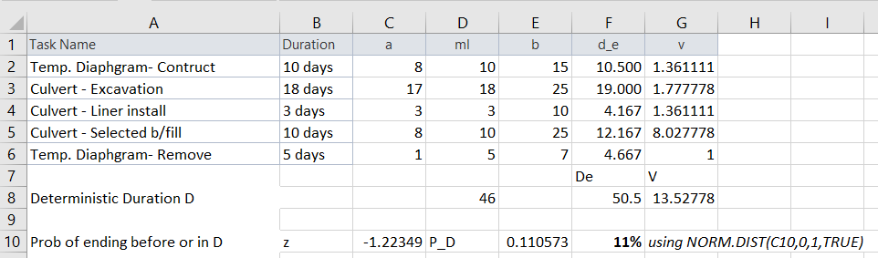
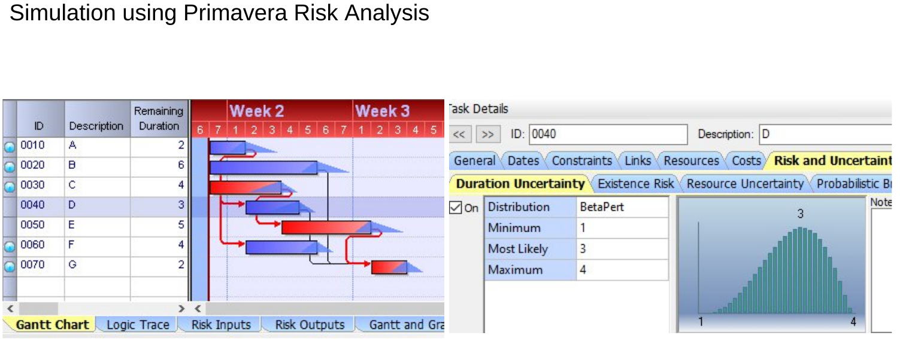
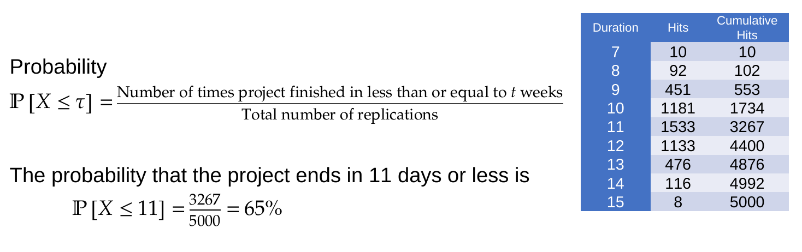

# 06-02 - Quantitative Risk Management

Paolo Eugenio Demagistris

---

## Quantitative Risk Management - Outline

Review of key risk management concepts
Nature of uncertainty
Decision making
Probabilistic scheduling - PERT
Probabilistic scheduling - Monte Carlo

---

## Risk Management - Definitions

* Project risk = ***uncertain*** event that, if it occurs, has a positive or negative ***effect on a project’s objectives*** 

* Project Risk Management (PRM)= planning, identifying, analyzing, responding, and monitoring project risk

---

## Risk Management - PRM Processes

---

## Nature of uncertainty

Project planning rests on **assumptions**

Risk is directly related to PM team knowledge about these assumptions.

The knowledge matrix helps in the classification of uncertainty as related to our identification of uncertainty vs the available knowledge.

---

### Risk knowledge matrix

---

### Risk Management - Statistical randomness

Risk variables are managed by:
* discrete probabilities / frequencies in decision making
* three-point distribution in statistical planning methods

---

### Decision making - Decision trees

We construct a tree chart detailing:
* decision nodes, where we branch different choices highlighting costs
* chance node, where we measure outcomes with different probability
* termination nodes, where we calculate probability weighted outcomes

---

---

---

### Decision on temporary culvert excavation support

* Cost of cutting slope to safe angle = 5,000$
* Cost of diaphragm = 7,000$
* Assume that each day in duration cost 1,000$ 
* Cut in cohesive soil = 2days = 2,000$ with p=20%
* Cut in loose soil = 20days = 20,000$ with p=80%
* Diaphragm by sheet piles = 1day = 1,000$ with p=70%
* Diaphragm by micro piles = 3days = 3,000$ plus 2,000$ materials with p=30%

We must decide whether to execute a temporary diaphragm or to cut the slope to a safe angle.

---

---

## Risk Management - PERT Probabilistic scheduling

Duration is assumed known by a three point distribution
* pessimistic a
* most likely m
* ottimistic b

We deduce from $\beta$ distribution:
* expected duration: $d=(a+4m+b)/6$
* standard deviation: $S=(b-a)/6$
* variance: $V=S^2$

---

For each activity k in the path
1. Obtain $a_k ,m_k ,b_k$
2. Compute expected activity duration $d_k=(a_k+4m_k+b_k)/6$
3. Compute activity variance $v_k = (\frac{b-a}{6})^2$
1. Compute expected path duration $D_e = f(d_k)$ using standard CPM algorithm
2. Compute path variance $V = \sum v_k$ as sum of critical path activity variance
3. Calculate the probability of path duration $D$ as $P(Z= \frac {D-D_e}{\sqrt{V}})$, where P is obtained by a Normal distribution function
   
---

---

---

## Risk Management - Monte Carlo numerical simulatiom

Replaces analytic solution with raw computing power - **specific software required!**
* Avoids need to simplify to get analytic solution
* No need to assume functional form of activity/project distributions

Allows determining the criticality index of an activity - Proportion of runs in which the
activity was in the critical path

Hundreds to thousands of simulations needed

---

Set the duration distribution for each activity
* No functional form of distribution assumed 
* Could be joint distribution for multiple activities
 
Iterate: for each “trial” (“realization”)

Sample random duration from each distributions

Find critical path and durations with standard CPM

Record these results

Report recorded results
• Duration distribution
• Per-node criticality index (% runs where critical)

---

---

---

# # Quantitative Risk Management - Reading

A. De Marco, Project Management for Facility Constructions, Second Edi. Springer International Publishing, 2018:
Part V – Uncertainty
